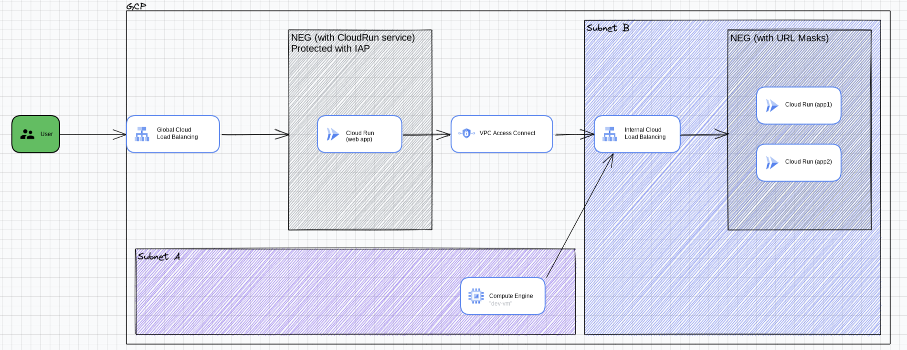

# Cloud Run with IAP
Simple Cloud Run deployment using Terraform, CloudBuild, Artifact Registry and protected with IAP

Source for enabling IAP with Cloud Run: [https://cloud.google.com/iap/docs/enabling-cloud-run](https://cloud.google.com/iap/docs/enabling-cloud-run)


## Overall architecture




## Project structure
```
. 
|-- app1 (web application based on Flask)
|   |-- Dockerfile
|   |-- main.py
|   `-- requirements.txt
|-- app2 (web application based on nginx)
|   |-- Dockerfile
|   `-- index.html
|-- app3 (web application based on NodeJS)
|   |-- Dockerfile
|   |-- index.js
|   `-- package.json
|-- README.md
|-- cloudbuild.yaml (build sequence for Cloud Build)
|-- cloudrun.tf (NEG and Cloud Run)
|-- config.tf (services and provider configuration)
|-- deploy.sh (deploy script using gcloud command for docker image "app")
|-- gcr.tf (managed artifact repository)
|-- install.sh (install script for gcp api using gcloud command)
|-- network.tf (VPC network definition, LB and IP)
|-- terraform.tfvars.json  (local env variables for terraform)
`-- vars.tf (variables configuration)

```

## Setup

1. Find out your GCP project's id and number from the dashboard in the cloud console, and update the following variables in the `terraform.tfvars.json` file. Replace `YOUR_PROJECT_NMR`, `YOUR_PROJECT_ID` and `your_project_region` with the correct values. Create an A record under your Cloud DNS and use this as `YOUR_DOMAIN`, and choose a private domain as a subset of your main domain as `YOUR_PRIVATE_DOMAIN`.

```shell
{
    "project_id": "YOUR_PROJECT_ID",
    "project_nmr": YOUR_PROJECT_NMR,
    "project_default_region": "YOUR_PROJECT_REGION",
    "domain": "YOUR_DOMAIN",
    "private_domain": "YOUR_PRIVATE_DOMAIN"
}
```

## Install

1. Run the following command at the root of the folder:
```shell 
$ sudo ./install.sh
$ terraform init
$ terraform plan
$ terraform apply
```

> Note: You may have to run `terraform plan` and `terraform apply` twice if you get errors for serviceaccounts not found

2. Build and deploy the docker image in CloudRun service, by issuing the following command at the root of the project:

```shell
$ ./deploy.sh
```

3. Point your browser to your domain URL `https://YOUR_DOMAIN` and within the application, choose the hyperlinks for app1 or app2 to see the result payload of the API call to the internal services.