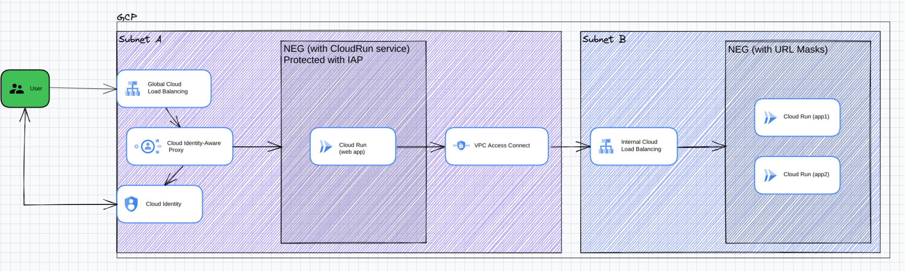

# Cloud Run with IAP
Simple Cloud Run deployment using Terraform, CloudBuild, Artifact Registry and protected with IAP

Source for enabling IAP with Cloud Run: [https://cloud.google.com/iap/docs/enabling-cloud-run](https://cloud.google.com/iap/docs/enabling-cloud-run)


## Overall architecture




## Project structure
```
.
|-- app (web application based on nginx)
|   |-- Dockerfile
|   `-- index.html
|-- run-iap (terraform module for LB + IAP + CloudRun)
|   |-- cloudrun.tf
|   |-- iam.tf
|   |-- network.tf
|   `-- vars.tf
|-- README.md
|-- cloudbuild.yaml (build sequence for Cloud Build)
|-- cloudrun.tf (custom module import and definition)
|-- config.tf (services and provider configuration)
|-- deploy.sh (deploy script using gcloud command for docker image "app")
|-- gcr.tf (managed artifact repository)
|-- install.sh (install script for gcp api using gcloud command)
|-- terraform.tfvars.json  (local env variables for terraform)
`-- vars.tf (variables configuration)

```

## Setup

1. Find out your GCP project's id and number from the dashboard in the cloud console, and update the following variables in the `terraform.tfvars.json` file. Replace `YOUR_PROJECT_NMR`, `YOUR_PROJECT_ID` and `your_project_region` with the correct values. `YOUR_IAP_SUPPORT_EMAIL` needs be part of your organisation, and in this example is both the support email for the IAP brand and the user allowed to access the Cloud Run prod service. Create an A record under your Cloud DNS and use this as `YOUR_DOMAIN`, and have it point to the Load Balancer static IP when it is created. Finally specify `YOUR_RUN_SERVICE_ID`, which will be the ID of your CloudRun service in which you can deploy docker containers present in the project's Artifact Registry.

```shell
{
    "project_id": "YOUR_PROJECT_ID",
    "project_nmr": YOUR_PROJECT_NMR,
    "project_default_region": "YOUR_PROJECT_REGION",
    "domain": "YOUR_DOMAIN"
}
```

## Install

1. Run the following command at the root of the folder:
```shell 
$ sudo ./install.sh
$ terraform init
$ terraform plan
$ terraform apply
```

> Note: You may have to run `terraform plan` and `terraform apply` twice if you get errors for serviceaccounts not found

2. Build and deploy the docker image in CloudRun service, by issuing the following command at the root of the project:

```shell
$ ./deploy.sh
```
